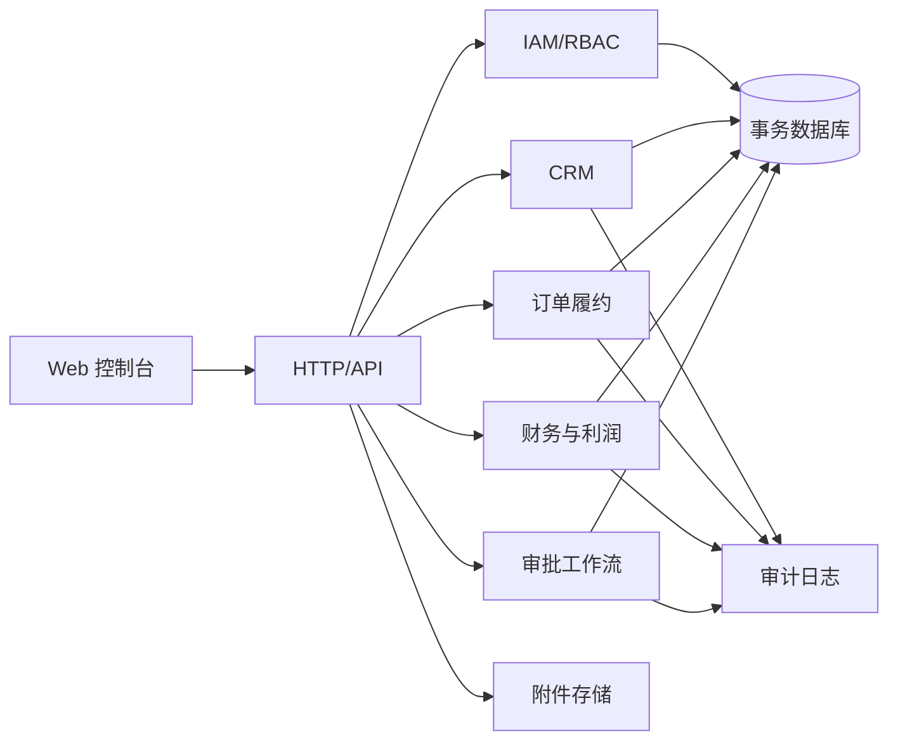

# 航贸云 ERP V1 架构设计

## 目标与边界

第一期服务 5–100 人外贸团队，覆盖客户、产品、供应商、报价、销售合同、采购、出运、收付款、利润、提成、审批与审计。目标可用性 99.9%，常用接口 p95 小于 500ms，金额计算使用最小货币单位整数，关键写操作必须事务化并可审计。

## 架构

采用模块化单体。浏览器通过同源 JSON API 访问 Node.js 服务；应用层按 IAM、CRM、OMS、SCM、物流、财务、利润、工作流、审计划分边界；SQLite 用于本机交付和小团队试运行，生产扩容时保持接口不变迁移至 PostgreSQL；附件落独立数据目录并通过鉴权下载。

## 已冻结业务规则

- 基础币种 CNY；业务币种支持 CNY、USD、EUR、GBP、JPY。
- 金额以分为单位保存，汇率保存 6 位小数；展示时统一格式化。
- 报价预估毛利率低于 15% 必须审批，负毛利禁止普通审批。
- SO 金额超过 CNY 500,000、账期超过 30 天升级总经理审批。
- PO/付款超过 CNY 200,000，或使用新供应商账户时双人审批。
- 采购与出运累计数量不得超过 SO 数量。
- 银行到账只能由财务角色确认；申请人不能最终审批自己。
- 客户 7 天无下一步跟进进入逾期；新询盘 4 个工作小时内首次响应。
- 审批 24 小时提醒，48 小时升级。
- 利润锁定条件：订单已交付、应收结清、应付确认、售后关闭。
- 提成基于锁定毛利，员工分配合计不得超过可分配利润的 40%。
- 业务单据只允许软删除；审批、付款、审计日志禁止删除。
- 会话 8 小时失效；连续登录失败触发短期锁定；所有变更写审计日志。

## ADR-001：模块化单体而非微服务

**决定：** 第一阶段使用单进程模块化单体。

**理由：** 团队规模和吞吐量不需要分布式系统；单体能提供跨订单、财务、审批的一致事务，部署和排障成本最低。

**代价：** 不能独立扩缩单个模块。通过清晰模块边界和无状态 HTTP 层保留未来拆分空间。

## ADR-002：关系数据库与整数金额

**决定：** 关系数据库；金额使用整数最小单位，汇率单独保存。

**理由：** 财务关系和状态流转需要 ACID、约束和可追溯查询；避免浮点误差。

**代价：** 多币种报表需要显式换算。所有换算结果同时保存原币、执行汇率和本币金额。

## ADR-003：服务端会话与 RBAC

**决定：** 使用 HttpOnly 同源会话，角色和动作双层授权。

**理由：** 内部 ERP 不需要把令牌暴露给浏览器脚本；服务端撤销简单，降低令牌泄漏风险。

**代价：** 横向扩容时会话需迁至共享存储。

## 失败模式与处置

| 失败 | 影响 | 处置 |
|---|---|---|
| 数据库不可用 | 无法读写 | 健康检查失败、停止写入、从最近备份恢复 |
| 重复提交 | 重复单据/付款 | 幂等键与唯一约束 |
| 审批期间数据变化 | 错批旧版本 | 审批绑定版本，版本不符拒绝 |
| 附件丢失 | 证据链不全 | 哈希校验、每日备份、鉴权下载 |
| 汇率或金额错误 | 利润失真 | 原币/本币并存、锁定前复核、冲正而非覆盖 |

